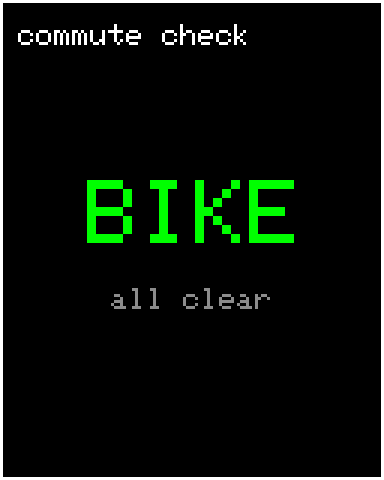
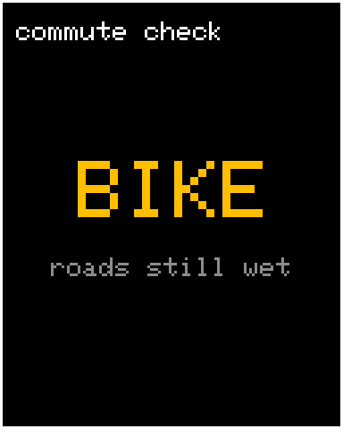
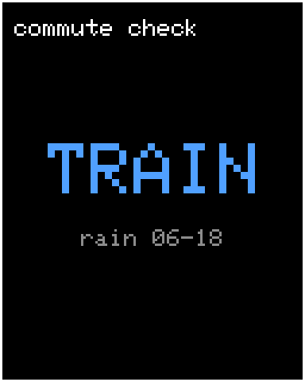

# bike-weather-display

A small display that pulls the MeteoSwiss rain forecast every morning and tells me whether to bike or take the train to university.

<p>
  
  
  
</p>

## How it decides

Every 20 minutes the device queries the MeteoSwiss app API for several postal codes along the route. Each zone is evaluated on its own, and the worst result wins.

| Priority | Condition | Result |
|---|---|---|
| 1 | Rain measured or forecast between 06:00 and 18:00 | **TRAIN** |
| 2 | Rain measured or forecast before 07:00 (roads still wet) | **BIKE_WET** |
| 3 | Otherwise | **BIKE_CLEAR** |

It uses two series from the API: `precipitation10m` (measured, 10-minute slots since midnight) and `precipitation1h` (forecast, hourly slots). Rain counts from 0.1 mm per slot.

---

## v1 — Raspberry Pi

`raspberry-pi/`

| File | Purpose |
|---|---|
| `weather_checker.py` | Fetches the forecast and runs the decision logic |
| `display.py` | Shows the matching screen from `images/` on the TFT; handles night mode |
| `log_snapshot.py` | Saves the raw API response every morning |
| `replay_snapshot.py` | Replays saved days through the decision logic |

### Hardware

Raspberry Pi 4 · 1.8″ ST7735S SPI TFT (128×160) · breadboard and jumper wires.

| Display | Pi |
|---|---|
| VCC | 3.3 V (pin 1) |
| GND | GND (pin 6) |
| DIN | GPIO 10 (pin 19) |
| CLK | GPIO 11 (pin 23) |
| CS | GPIO 8 (pin 24) |
| DC | GPIO 24 (pin 18) |
| RST | GPIO 25 (pin 22) |
| BL | GPIO 18 (pin 12) — software backlight for night mode |

Enable SPI first: `sudo raspi-config` → Interface Options → SPI. Set the time zone to Europe/Zurich under Localisation Options, because the rain times are read in the Pi's local time.

### Setup

Current Raspberry Pi OS blocks `pip install` outside a virtual environment, so everything runs from one. `--system-site-packages` lets it use the Pi's preinstalled GPIO libraries.

```bash
git clone https://github.com/<you>/bike-weather-display.git ~/bike-weather-display
cd ~/bike-weather-display/raspberry-pi
python3 -m venv --system-site-packages .venv
source .venv/bin/activate
pip install -r requirements.txt
cp config.example.py config.py      # then add your postal codes

python3 weather_checker.py          # decision only, printed to the terminal
python3 display.py                  # decision + update the display
python3 display.py 0|1|2            # force a state (0=TRAIN 1=WET 2=CLEAR)
python3 display.py --off            # backlight off
```

### Running on the Pi

Add these with `crontab -e`. Replace `<user>` with your username on the Pi (`whoami`). Cron has to call the Python inside `.venv`, otherwise the installed packages are missing.

```
@reboot      sleep 30 && /home/<user>/bike-weather-display/raspberry-pi/.venv/bin/python /home/<user>/bike-weather-display/raspberry-pi/display.py
*/20 * * * * /home/<user>/bike-weather-display/raspberry-pi/.venv/bin/python /home/<user>/bike-weather-display/raspberry-pi/display.py
55 6 * * *   /home/<user>/bike-weather-display/raspberry-pi/.venv/bin/python /home/<user>/bike-weather-display/raspberry-pi/log_snapshot.py
```

The backlight turns off between 19:00 and 06:00.

### Backtesting

`log_snapshot.py` stores each morning's raw API response in `snapshots/YYYY-MM-DD.json`. `replay_snapshot.py` runs those saved days through `decide()`, so changes to the logic can be checked against real past weather before they go live.

```bash
python3 replay_snapshot.py              # all saved days
python3 replay_snapshot.py 2026-06-09   # one day
```

Snapshots stay local and are not part of the repository.

---

## What's next

A port to an ESP32-S3 is in progress: same display, a push button that wakes the device from deep sleep, and much lower power draw than the Pi, so it can become a proper device.
